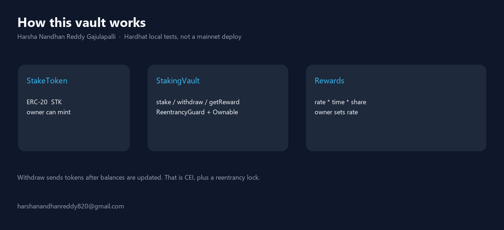
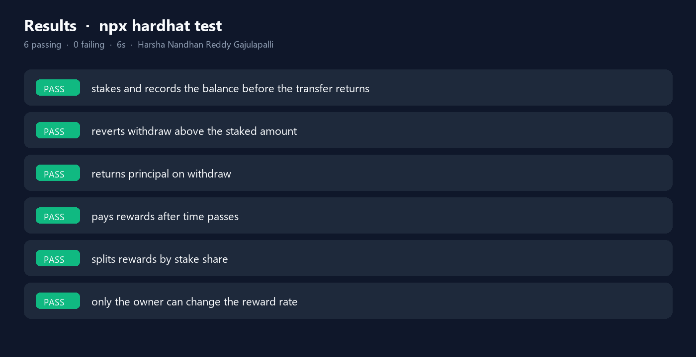

# ERC-20 Staking Vault

Stake an ERC-20 (`STK`). Earn more `STK` at a per-second rate the owner sets.

- `ReentrancyGuard` on `stake`, `withdraw`, `getReward`
- State updates **before** `safeTransfer` / `safeTransferFrom`
- `onlyOwner` on `setRewardRate` and token mint

This is a **lab contract**. It is not a professional audit and it was **not** deployed to Sepolia in this run.

Author: **Harsha Nandhan Reddy Gajulapalli**  
Email: **harshanandhanreddy820@gmail.com**



## Run

```bash
npm install
npx hardhat test
python render_images.py
```

## Results

`npx hardhat test` on the local Hardhat network, Solidity 0.8.20.

**6 passing, 0 failing, ~6s.**



| Test | Result |
|---|---|
| Stake records the balance before the transfer returns | pass |
| Withdraw above staked amount reverts | pass |
| Withdraw returns principal | pass |
| Rewards accrue after 100 seconds (~100 tokens at 1 token/s) | pass |
| Two equal stakers earn about the same | pass |
| Non-owner cannot change `rewardRate` | pass |

JSON: `results/tests.json`

No private key was used. No testnet tx.

## Layout

```
contracts/StakeToken.sol     ERC-20 + onlyOwner mint
contracts/StakingVault.sol   stake / withdraw / getReward
test/StakingVault.js         six Hardhat tests
scripts/deploy.js            local deploy helper
```

## License

MIT. Copyright (c) 2026 Harsha Nandhan Reddy Gajulapalli.
